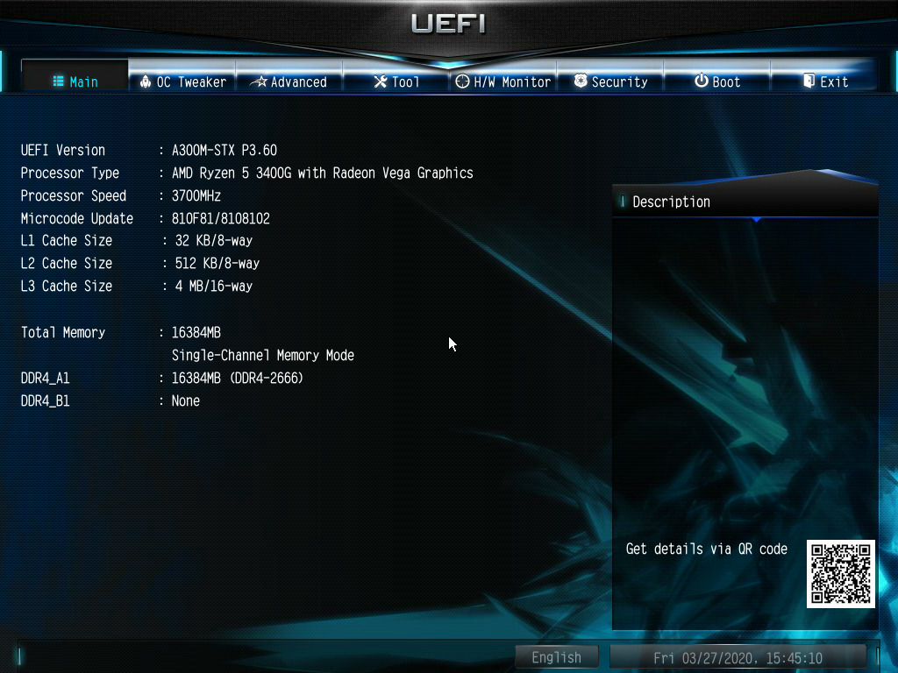

## Agenda

- History
- Modern Firmware Menus
- Ideas for Desktop
- Ideas for Boot Menu

# Introduction

## Hello, I am Daniel :-)

:::::::::::::: {.columns}
::: {.column width="42%"}
{ width=100% }
:::
::: {.column width="58%"}
### Work and education
- IT security and computer science
- software engineer
- infrastructure and web
- apps, UIs, ecommerce

### Open Source contributions
- hardware and firmware
- operating systems
- software distributions
- reverse engineering
- author of [fiedka.app](https://fiedka.app/)
:::
::::::::::::::

# History

## Early Firmware and Interfaces

. . .

### BIOS

- first compatible commercial implementation by Phoenix Technologies[^1]
- sparked the IBM PC compatible computer

. . .

### Open Firmware

- first non-proprietary boot firmware for different processors and buses[^2]
- shell UI based on Forth

[^1]: [https://historyofinformation.com/detail.php?entryid=3846](
https://historyofinformation.com/detail.php?entryid=3846)

[^2]: [http://www.firmworks.com/www/ofw.htm](
http://www.firmworks.com/www/ofw.htm)

## Open Firmware Interfaces

# Modern Firmware Menus

## TUI vs GUI vs NUI

## Open Source Implementations

### coreboot

- firmware setup menu

https://zirblazer.github.io/htmlfiles/coreboot.html?ver=123#chapter-3

### LinuxBoot

- Heads
- `webboot` menu
- `boot` menu

## Graphical Firmware User Interfaces

{ height=84% }

## UI Features

The UI has clickable elements, but mostly, simple text.

. . .

### Informative

- hard component info: DRAM, CPU, ...
- soft component info: firmware itself, ucode, ...
- hardware monitor
- QR code: link to the manual
- date/time, internationalization

. . .

### Settings

- clock adjustments
- boot media / source, order, default
- Secure Boot key provisioning

# Ideas ...

## Foo

https://www.thomas-krenn.com/de/wikiDE/imagemaps/html/mainboards/asus_z9pr-d12_4l/pcie_slot_option_rom_configuration.php

## Network Video Recorders (NVRs)

:::::::::::::: {.columns}
::: {.column width="52%"}
{ height=80% }
:::
::: {.column width="48%"}
### old ideas
- essentially storage with more connectors
  * USB, HDMI, ethernet
  * built-in network switch
  * analog video input
- SoC, mostly Arm, running Linux

### new ideas
- little general purpose computer with web browser
- home theatre / movie player
:::
::::::::::::::

## IP cameras

Essentially, these are just camera sensors attached to some SoC that is
running Linux, with Wi-Fi and/or ethernet modules and often SD card
readers.

:::::::::::::: {.columns}
::: {.column width="40%"}
{ height=85% }
:::
::: {.column width="30%"}
{ height=85% }
:::
::: {.column width="30%"}
{ height=85% }
:::
::::::::::::::

They typically feature two motors to rotate and tilt, sometimes a
speaker and a microphone for two-way audio communication.

OpenIPC project - [https://openipc.org/](https://openipc.org/)

