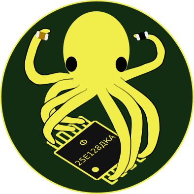
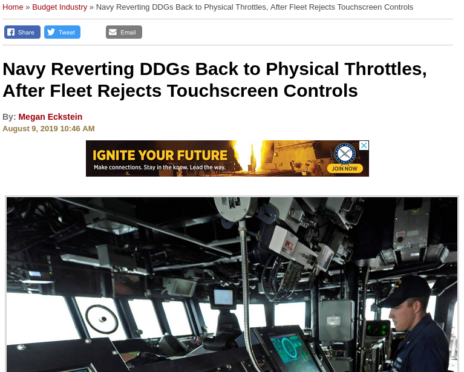
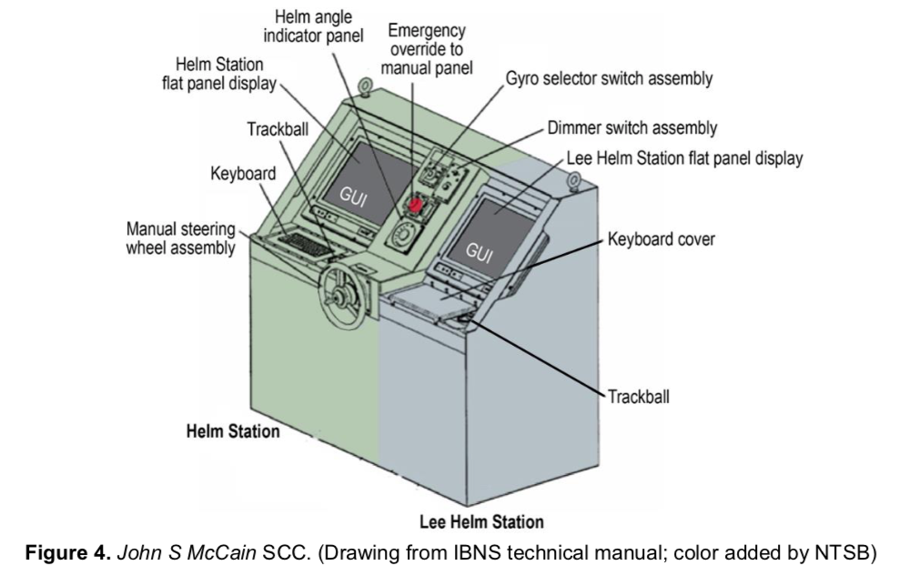
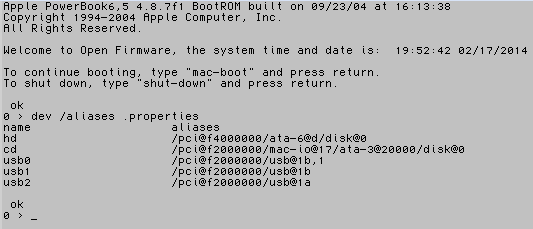
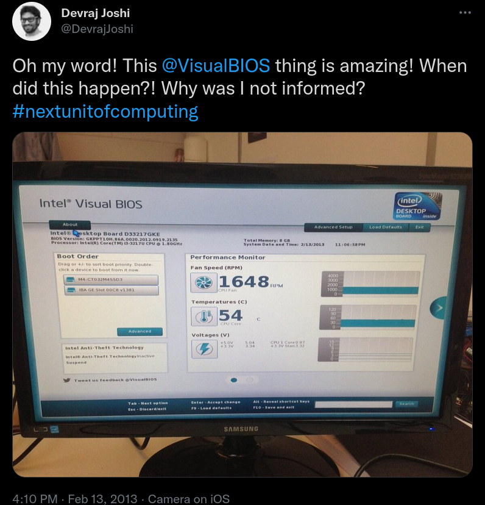
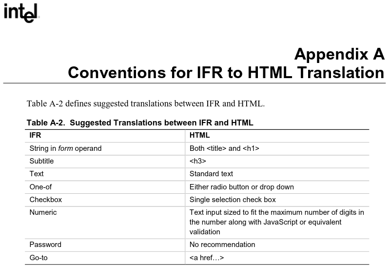
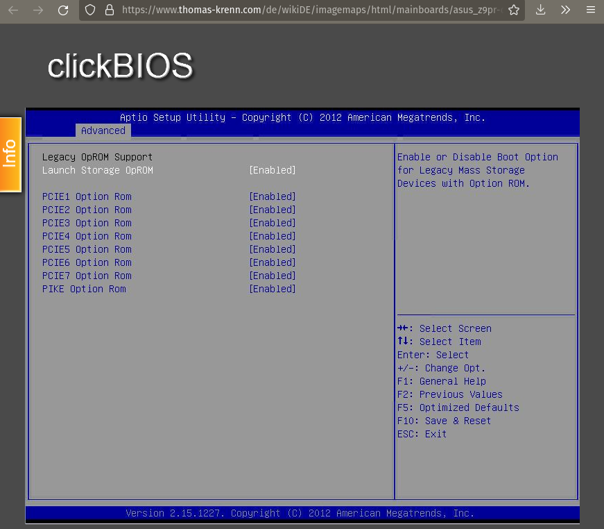

## Agenda

- Introduction
- History
- Modern Firmware Interfaces
- Ideas for Open Source Firmware

# Introduction

## Hello, I am Daniel :-)

:::::::::::::: {.columns}
::: {.column width="42%"}
{ width=100% }
:::
::: {.column width="58%"}
### Work and education
- IT security and computer science
- software engineer
- infrastructure and web
- apps, UIs, ecommerce

### Open Source contributions
- hardware and firmware
- operating systems
- software distributions
- reverse engineering
- [Fiedka the Firmware Editor](https://fiedka.app/)
:::
::::::::::::::

## Fiedka

Fiedka is a graphical firmware editor app[^0].

{ height=70% }

[^0]: [https://fiedka.app/](https://fiedka.app/)

## User Interfaces are Critical[^7]

{ height=80% }

[^7]: [https://news.usni.org/2019/08/09/navy-reverting-ddgs-back-to-physical-throttles-after-fleet-rejects-touchscreen-controls](
https://news.usni.org/2019/08/09/navy-reverting-ddgs-back-to-physical-throttles-after-fleet-rejects-touchscreen-controls)

## User Interface Design

:::::::::::::: {.columns}
::: {.column width="93%"}

:::
::: {.column width="7%"}
:::
::::::::::::::

# History

## Early Firmware and Interfaces

. . .

### BIOS

- first compatible commercial implementation by Phoenix Technologies[^1]
- sparked the IBM PC compatible computer

. . .

### Open Firmware (IEEE 1275)

- first non-proprietary boot firmware for different processors and buses[^2]
- Forth interpreter as UI

. . .

### EFI

- Human Interface Infrastructure (HII)[^3]
- standardized protocol and data structures for building forms

[^1]: [https://historyofinformation.com/detail.php?entryid=3846](
https://historyofinformation.com/detail.php?entryid=3846)

[^2]: [http://www.firmworks.com/www/ofw.htm](
http://www.firmworks.com/www/ofw.htm)

[^3]: [https://www.intel.com/content/dam/www/public/us/en/documents/reference-guides/efi-human-interface-infrastructure-specification-v09.pdf](
https://www.intel.com/content/dam/www/public/us/en/documents/reference-guides/efi-human-interface-infrastructure-specification-v09.pdf)

## Open Firmware Interfaces


## Open Firmware Interactive Environment



image originally from [https://www.morphos-team.net/guide/usb-boot](
https://www.morphos-team.net/guide/usb-boot)

see also [https://www.youtube.com/watch?v=u9OMOHl73IE](https://www.youtube.com/watch?v=u9OMOHl73IE)

## Visual BIOS[^8]

{ height=86% }

[^8]: [https://twitter.com/DevrajJoshi/status/301710041109639169](
https://twitter.com/DevrajJoshi/status/301710041109639169)

# Modern Firmware Interfaces

## NUI vs TUI vs GUI

. . .

### NUI

No user interface - this applies to embedded devices mostly, where interactive access is not necessary.

. . .

### TUI

Textual user interface - this is available even in non-graphical environments, such as via serial console.

. . .

### GUI

Graphical user interface - this is most suitable for end users, can support accessibility.

## Open Source Implementations

. . .

### coreboot

- `nvramtool` (for OS), nvramcui (payload)[^4]
- coreinfo (payload)
- corevantage, coreboot-configurator (GUIs)

. . .

### LinuxBoot

- shell
- Heads
- `webboot` and `boot` menu (TUI)

. . .

### U-Boot

- interactive command interface

. . .

### Tianocore / EDK2

- UEFI Shell
- interactive menu (TUI)

[^4]: https://zirblazer.github.io/htmlfiles/coreboot.html?ver=123#chapter-3

## Graphical Firmware User Interfaces

{ height=84% }

## UI Features

The UI has clickable elements, but mostly, simple text.

. . .

### Informative

- hard component info: DRAM, CPU, ...
- soft component info: firmware itself, ucode, ...
- hardware monitor
- QR code: link to the manual
- date/time, internationalization

. . .

### Settings

- clock adjustments
- boot media / source, order, default
- Secure Boot key provisioning

. . .

Note: screenshot taken from within the UI, stored to USB drive

## EFI variables

```
$ xxd /sys/firmware/efi/efivars/SMBIOSELOG000-c3eeae98-23bf-412b-*
00000000: 0700 0000 0000 0000 0060 0160 0000 0000 .........`.`....
00000010: 0000 0001 0890 1901 0100 0108 0002 0000 ................
00000020: 0000 0000 0890 1901 0100 0118 0002 0000 ................
00000030: 0000 0000 0890 1901 0100 0236 0002 0000 ...........6....
00000040: 0000 0000 0890 1901 0100 0302 0002 0000 ................
00000050: 0000 0000 0890 1901 0100 0035 0010 0000 ...........5....
00000060: 0000 0000 0890 1901 0100 0035 0002 0000 ...........5....
00000070: 0000 0000 0890 1901 0100 0042 0002 0000 ...........B....
00000080: 0000 0000 0890 2006 2808 3720 0002 0000 ...... .(.7 ....
```

. . .

Can we create or do we have a parser and a viewer for this?

## coreboot `nvramtool`

### dump coreboot tables: `nvramtool -d`

```
coreboot table at physical address 0x76b42000:
    signature:       0x4f49424c (ASCII: LBIO)
    header_bytes:    0x18 (decimal: 24)
    header_checksum: 0x4d99 (decimal: 19865)
    table_bytes:     0x7d4 (decimal: 2004)
    table_checksum:  0x18b9 (decimal: 6329)
    table_entries:   0x2c (decimal: 44)

    CMOS_OPTION_TABLE record at physical address 0x76b42018:
        tag:  0xc8 (decimal: 200)
        size: 0x294 (decimal: 660)
        data:
...
```

. . .

Could this be more intuitive?

## Star Labs coreboot-configurator

strongly inspired by or reworked copy of [corevantage](https://github.com/JaGoLi/corevantage) invoking `nvramtool`

{ height=70% }

# Ideas for Open Source Firmware

## LinuxBoot

### Simple

Add a splashscreen image, e.g., using the [`fbsplash`](
https://github.com/u-root/u-root/tree/main/cmds/exp/fbsplash) command in u-root.

. . .

### Advanced

Render an image around the TUI, possibly like [`fbcondecor`](https://github.com/jirka-grunt/fbcondecor).

{ height=65% }

## Back to HII...

:::::::::::::: {.columns}
::: {.column width="93%"}

:::
::: {.column width="7%"}
:::
::::::::::::::

## Simulator[^6]

{ height=80% }

[^6]: [https://www.thomas-krenn.com/de/wikiDE/imagemaps/html/mainboards/asus_z9pr-d12_4l/pcie_slot_option_rom_configuration.php](
https://www.thomas-krenn.com/de/wikiDE/imagemaps/html/mainboards/asus_z9pr-d12_4l/pcie_slot_option_rom_configuration.php)

## User Experience (UX)[^3]

. . .

> Encourage a “walk up and use” (WUU) user interface. Most applications are designed to be
> used repeatedly. User interface designers must trade off learnability for usability. The goal of
> WUU applications is to be instantly usable without a learning curve or other documentation.

. . .

> Design characteristics include the following:

  - A simplified interface.
  - Continual display of both keys and context-sensitive help, rather than having the user
    ask for it.
  - Minimal shortcuts (most people become confused by more than one method for
    doing things).
  - An interface that is analogous to a common interface. At this time, a generic web browser
    is probably the most universal nonproprietary interface.

## UEFI Configuration Namespace[^5]

:::::::::::::: {.columns}
::: {.column width="50%"}

:::
::: {.column width="50%"}
### Approach

- Form {Builder, Generator}
- schemas defined by spec
- can be implemented in [Fiedka](https://fiedka.app/)
- Fiedka is based on Electron, i.e., a web browser with OS interfacing

{ height=30% }
:::
::::::::::::::

[^5]: [https://uefi.org/namespace_instructions](https://uefi.org/namespace_instructions)

## Notes on Security and Safety

. . .

### Principle of Least Privilege (PoLP)

Interfaces should guard from full access.

Restricted access prevents accidents and compromise.

. . .

### Robustness

Configuration means (user) input.

Input _must_ be validated.

Define fallbacks for resilience.

## Awareness

> Remember: User interfaces are critical!

. . .

Pick a user interface that fits the need, even if it seems old-fashioned.

{ height=70% }

# Thanks!

# Questions?
